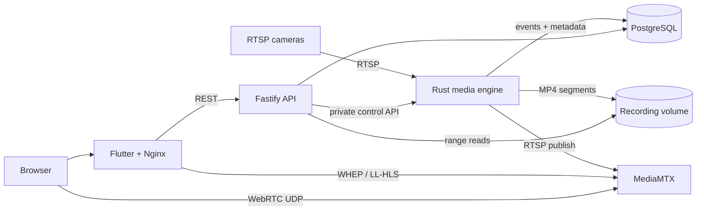

<div align="center">


# Aegivue

**A self-hosted network video recorder for reliable RTSP capture, low-latency
live viewing, and motion-aware recording.**

[](https://github.com/prinako/aegivue/actions/workflows/ci.yml)
[](https://github.com/prinako/aegivue/actions/workflows/docker.yml)
[](LICENSE)
[](https://flutter.dev/)
[](https://www.rust-lang.org/)

[Quick start](#quick-start) · [Features](#features) · [Architecture](#architecture) ·
[Documentation](#documentation) · [Development](#development) · [Roadmap](#roadmap)

</div>

> [!WARNING]
> Aegivue is under active development and does not yet include built-in
> authentication. Use it on a trusted network or behind an authenticated reverse
> proxy. Do not expose the dashboard or API directly to the public internet.

Aegivue keeps video on infrastructure you control. A Rust media engine isolates
camera and FFmpeg workloads, a Fastify API manages configuration and metadata,
MediaMTX delivers browser-friendly live streams, and Flutter provides the control
surface. PostgreSQL stores searchable state while finalized media remains on a
dedicated recording volume.

## Why Aegivue?

- **Failure isolation:** each camera runs in a supervised worker, so one unreliable
  stream does not take down the rest of the system.
- **Efficient capture:** compatible H.264/H.265 streams are remuxed into MP4
  without mandatory video transcoding.
- **Fast live view:** browsers use WebRTC first, with Low-Latency HLS as a
  fallback.
- **Event-aware recording:** motion mode supports rolling pre-event footage,
  configurable post-event capture, and event-to-recording linkage.
- **Local ownership:** recordings and operational metadata stay in your Docker
  volumes or mounted storage.
- **Open interfaces:** camera control, recordings, events, health, and media are
  exposed through a documented REST API.

## Features

| Area | Capabilities |
| --- | --- |
| Cameras | RTSP configuration, enable/disable controls, runtime status, automatic worker recovery |
| Recording | Continuous or motion-triggered MP4 segments, atomic finalization, pre/post-event capture |
| Playback | Paginated library, downloads, HTTP range requests, expiry controls |
| Retention | Per-camera retention, protected recordings, automatic file and metadata cleanup |
| Live view | WebRTC, LL-HLS fallback, substream preference, adaptive camera grid, focused viewer |
| Motion | Supervised frame-difference detector, configurable stream/FPS/sensitivity, persisted events |
| Platform | Flutter web UI, Fastify/OpenAPI control plane, Rust/Tokio media engine, PostgreSQL |
| Deployment | Docker Compose, private service networks, health checks, prebuilt GHCR images |

H.264 and H.265 camera streams that FFmpeg can remux into MP4 are the current
recording target. H.264 is recommended for browser live viewing because H.265
support varies across browsers and operating systems.

## Project status

Aegivue is an **early-stage HomeLab NVR** with a working end-to-end foundation.
Core camera management, continuous recording, live viewing, retention, motion
events, and motion-triggered capture are implemented. Security hardening, advanced
detection, and broader hardware validation remain in progress.

| Status | Area |
| --- | --- |
| ✅ Available | Camera CRUD and lifecycle control |
| ✅ Available | Continuous recording and indexed playback |
| ✅ Available | WebRTC live view with LL-HLS fallback |
| ✅ Available | Retention and expiry cleanup |
| 🧪 Foundation | Motion detection, event timeline, and triggered recording |
| 🚧 Planned | Authentication, authorization, and encrypted secret storage |
| 🚧 Planned | Motion zones, AI detection, and notifications |

See the [roadmap](#roadmap) for current priorities.

## Quick start

### Requirements

- Docker Engine
- Docker Compose v2
- An RTSP camera reachable from the Docker host, optional for initial startup

### 1. Configure

```sh
git clone https://github.com/prinako/aegivue.git
cd aegivue
cp .env.example .env
```

Set a long, random `AEGIVUE_POSTGRES_PASSWORD` in `.env`. If another device will
open live video, also set `AEGIVUE_WEBRTC_HOST` to the Aegivue host's reachable LAN
address or DNS name.

Validate the effective configuration:

```sh
docker compose config --quiet
```

### 2. Start

```sh
docker compose up -d
docker compose ps
curl --fail http://127.0.0.1:3000/api/v1/health
```

| Service | Default address |
| --- | --- |
| Dashboard | <http://127.0.0.1:8080> |
| OpenAPI UI | <http://127.0.0.1:3000/docs> |
| Health endpoint | <http://127.0.0.1:3000/api/v1/health> |

The API and dashboard bind to localhost by default. WebRTC media uses UDP port
`8189`; remote browsers must be able to reach that port.

### 3. Add a camera

Use **Cameras** in the dashboard or call the API:

```sh
curl --fail-with-body -X POST http://127.0.0.1:3000/api/v1/cameras \
  -H 'content-type: application/json' \
  -d '{
    "id": "front-door",
    "name": "Front Door",
    "connection": {
      "protocol": "rtsp",
      "host": "192.168.1.10",
      "port": 554,
      "username": "camera-user",
      "password": "replace-me",
      "mainStream": "/Streaming/Channels/101",
      "subStream": "/Streaming/Channels/102"
    }
  }'
```

RTSP paths vary by manufacturer. Follow the [camera setup guide](docs/cameras/rtsp.md)
for codec guidance, live-view verification, and troubleshooting.

### 4. Stop safely

```sh
docker compose down
```

This keeps the PostgreSQL and recording volumes. Do not add `--volumes` unless you
intend to delete data managed by Compose.

## Architecture



| Component | Responsibility |
| --- | --- |
| [`apps/web`](apps/web) | Flutter dashboard and Nginx same-origin proxy |
| [`apps/api`](apps/api) | Fastify control plane, validation, OpenAPI, and media delivery |
| [`crates/media-engine`](crates/media-engine) | Camera supervision, FFmpeg, recording, motion analysis, and retention |
| [`crates/aegivue-common`](crates/aegivue-common) | Shared Rust contracts |
| MediaMTX | WebRTC and LL-HLS stream delivery |
| [`database/migrations`](database/migrations) | PostgreSQL schema evolution |

PostgreSQL is the durable desired state. The media engine reconciles enabled
cameras into isolated workers. Active segments use a `.mp4.partial` suffix and are
atomically finalized before they are indexed and exposed for playback.

Read the [architecture overview](docs/architecture/overview.md) for data flows,
network boundaries, storage invariants, and failure behavior.

## Documentation

The [Aegivue handbook](docs/README.md) is organized by task:

| Guide | Use it for |
| --- | --- |
| [Configuration reference](docs/reference/configuration.md) | Environment variables, ports, defaults, and camera settings |
| [RTSP camera setup](docs/cameras/rtsp.md) | Adding cameras and diagnosing stream problems |
| [Motion and events](docs/motion/events.md) | Detector behavior, triggered recording, API, and limitations |
| [Upgrade guide](docs/operations/upgrades.md) | Backups, images, migrations, and schema verification |
| [Troubleshooting runbook](docs/operations/troubleshooting.md) | Symptom-first operational checks |
| [Development setup](docs/development/getting-started.md) | Toolchains, local stack, CI checks, and integration tests |
| [Architecture overview](docs/architecture/overview.md) | Components, data flows, trust boundaries, and resilience |

Interactive API documentation is also available at `/docs` while the API is
running.

## API overview

All application endpoints are rooted at `/api/v1`.

| Resource | Main operations |
| --- | --- |
| `/health` | API and database health |
| `/cameras` | List, create, read, update, delete, start, stop, and inspect status |
| `/recordings` | Paginate metadata, read details, update expiry, and stream media |
| `/events` | Paginate and filter events or read an individual event |

Camera passwords and internal storage paths are omitted from API read models.

## Configuration

Deployment settings live in an untracked `.env` based on [`.env.example`](.env.example).
The most commonly changed values are:

| Variable | Default | Purpose |
| --- | --- | --- |
| `AEGIVUE_POSTGRES_PASSWORD` | required | PostgreSQL password for the Compose stack |
| `AEGIVUE_API_BIND` | `127.0.0.1` | Host address for API port `3000` |
| `AEGIVUE_WEB_BIND` | `127.0.0.1` | Host address for dashboard port `8080` |
| `AEGIVUE_WEBRTC_HOST` | `127.0.0.1` | Address advertised to WebRTC clients |
| `AEGIVUE_WEBRTC_ICE_BIND` | `0.0.0.0` | Host address for UDP port `8189` |
| `AEGIVUE_RECORDING_SEGMENT_SECONDS` | `60` | Recording segment duration (`5`–`3600`) |
| `AEGIVUE_IMAGE_TAG` | `latest` | API, media, and web image tag |

See the [configuration reference](docs/reference/configuration.md) before changing
network exposure, storage mounts, proxy trust, or service-internal settings.

## Development

The development stack builds all application services from the checkout:

Copy the example environment file and set `AEGIVUE_POSTGRES_PASSWORD` before
starting the stack.

```sh
cp .env.example .env
docker compose -f docker-compose.yml -f docker-compose.dev.yml up --build
```

Run the same core checks used by CI:

```sh
npm ci --prefix apps/api
npm --prefix apps/api run typecheck
npm --prefix apps/api run lint
npm --prefix apps/api run format:check
npm --prefix apps/api test

cargo fmt --check
cargo clippy --all-targets --all-features -- -D warnings
cargo test

cd apps/web
flutter pub get
dart format --output=none --set-exit-if-changed .
flutter analyze
flutter test
```

Required toolchains are Node.js 22+, stable Rust with `rustfmt` and `clippy`, and
Flutter 3.38.7. See [development setup](docs/development/getting-started.md) for the
complete workflow and camera-free integration test.

## Security

- There is currently **no built-in authentication or authorization**.
- Keep API and dashboard bindings private or protect them with an authenticated
  reverse proxy.
- Give only the media engine network access to cameras in a hardened deployment.
- Camera secrets are omitted from API responses and sanitized from structured
  diagnostics, but encrypted secret storage is not yet implemented.
- Never commit `.env`, camera credentials, or credential-bearing RTSP URLs.

Please do not disclose vulnerabilities in public issues. A dedicated private
security reporting process is planned.

## Upgrading

Application images and database migrations form one release unit. Back up both
PostgreSQL and the recording volume, update the checkout, then apply migrations
before recreating services:

```sh
git pull
docker compose pull
docker compose run --rm aegivue-migrate
docker compose up -d
```

Read the [upgrade guide](docs/operations/upgrades.md) before upgrading an existing
installation or recovering from a schema mismatch.

## Roadmap

Near-term priorities include:

- authentication, authorization, and encrypted camera-secret storage;
- versioned migration artifacts and stronger deployment compatibility checks;
- motion zones, exclusion zones, and false-positive suppression;
- storage quotas, usage reporting, and recording protection workflows;
- ONVIF discovery and camera configuration;
- optional AI detection and event enrichment;
- notifications and alert integrations;
- broader camera, codec, browser, and platform validation.

Roadmap items describe intent, not a release commitment.

## Contributing

Issues and pull requests are welcome. Keep changes focused, update documentation
with behavior or configuration changes, and run the relevant checks from
[Development](#development) before submitting a pull request.

## License

Aegivue is licensed under the [GNU Affero General Public License v3.0](LICENSE).
