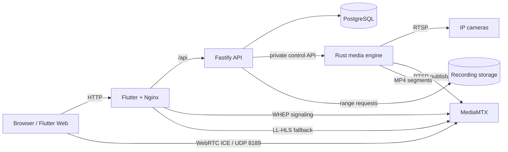

<div align="center">


# Aegivue

**A self-hosted network video recorder focused on reliable RTSP recording, low-latency live viewing, and a modern Flutter control surface.**

[](https://github.com/prinako/aegivue/actions/workflows/ci.yml)
[](https://github.com/prinako/aegivue/actions/workflows/docker.yml)
[](LICENSE)

[Features](#features) · [Project status](#project-status) · [Quick start](#quick-start) · [Architecture](#architecture) · [Frontend](#frontend) · [API](#api) · [Development](#development) · [Security](#security) · [Roadmap](#roadmap)

</div>

> [!IMPORTANT]
> Aegivue is under active development. It is suitable for HomeLab, development, and controlled testing environments, but it is not yet ready to be exposed directly to the public internet without an authenticated reverse proxy and additional hardening.

Aegivue is an open-source NVR built around isolated camera workers, stream-copy recording, PostgreSQL metadata, browser-friendly live streaming, and a Flutter frontend. Video stays on local or mounted storage while the API and database manage configuration, runtime state, and recording metadata.

## Features

- RTSP recording through FFmpeg without mandatory transcoding
- Per-camera worker isolation so one failing stream does not stop the others
- Automatic recovery of enabled cameras after service restarts
- MP4 segment recording with atomic finalization and metadata indexing
- Low-latency WebRTC live viewing with Low-Latency HLS fallback
- Dedicated **Live view** tab with an adaptive camera grid
- Intelligent grid sizing based on viewport size and number of registered cameras
- Click-to-focus camera viewing in a dedicated large viewer
- Automatic substream preference for lower-bandwidth live viewing
- Paginated recording history and HTTP byte-range playback
- Camera lifecycle controls and runtime status reporting through a REST API
- Flutter dashboard with Provider + ChangeNotifier state management
- Feature-based Flutter project structure for cameras, dashboard, and recordings
- OpenAPI documentation plus health/readiness endpoints
- Container-first deployment with Docker Compose and prebuilt GHCR images

H.264 and H.265 RTSP streams that can be remuxed into MP4 are the current recording target. Browser live viewing is optimized for H.264; codec support varies by browser and platform.

## Project status

Aegivue has moved beyond the initial prototype stage. The core recording, API, live streaming, Docker, and Flutter foundations are in place, while security, event processing, and advanced automation are still being developed.

| Area | Status | Notes |
| --- | --- | --- |
| Docker / service architecture | Mature foundation | API, media engine, MediaMTX, PostgreSQL, Flutter/Nginx |
| Camera configuration | Working | Create, edit, enable/disable, runtime state |
| Continuous recording | Working | FFmpeg stream-copy segments with metadata indexing |
| Live viewing | Working | WebRTC first, LL-HLS fallback |
| Live camera wall | Working | Adaptive grid with focused camera view |
| Flutter architecture | Working | Feature-based layout with shared/core modules |
| Flutter state management | Working foundation | Provider + ChangeNotifier for dashboard state |
| Recording library | In progress | Listing and playback exist; UX still evolving |
| Authentication / authorization | Not implemented | Keep the app private or behind authenticated access |
| Motion detection | Planned / early | Configuration fields exist; processing is not yet complete |
| AI detection | Planned | Future dedicated processing service |
| Notifications | Planned | Event-driven alerts are not yet implemented |

## Quick start

### Requirements

- Docker Engine
- Docker Compose v2
- An RTSP camera reachable from the Docker host

Clone the repository and create your environment file:

```sh
git clone https://github.com/prinako/aegivue.git
cd aegivue
cp .env.example .env
```

Set a strong `AEGIVUE_POSTGRES_PASSWORD` in `.env`.

If browsers on other devices will use WebRTC, set `AEGIVUE_WEBRTC_HOST` to the LAN IP or DNS name that reaches the Aegivue host. UDP port `8189` must also be reachable from those clients.

Start the stack:

```sh
docker compose up -d
docker compose ps
curl http://127.0.0.1:3000/api/v1/health
```

Open:

| Service | URL |
| --- | --- |
| Web dashboard | <http://127.0.0.1:8080> |
| API documentation | <http://127.0.0.1:3000/docs> |
| API health check | <http://127.0.0.1:3000/api/v1/health> |

By default, PostgreSQL, the media engine, and MediaMTX control endpoints stay on private Docker networks. The web dashboard and API bind to localhost unless changed in `.env`; WebRTC media uses UDP `8189`.

Add a camera through the Flutter dashboard or directly through the API:

```sh
curl -X POST http://127.0.0.1:3000/api/v1/cameras \
  -H 'content-type: application/json' \
  -d '{
    "id": "front-door",
    "name": "Front Door",
    "connection": {
      "protocol": "rtsp",
      "host": "192.168.1.10",
      "port": 554,
      "username": "camera-user",
      "password": "replace-me",
      "mainStream": "/Streaming/Channels/101",
      "subStream": "/Streaming/Channels/102"
    }
  }'
```

Camera URL formats vary by manufacturer. See [Adding an RTSP camera](docs/cameras/rtsp.md) for the supported configuration shape.

Stop Aegivue without deleting its database or recordings:

```sh
docker compose down
```

## Architecture



| Component | Responsibility |
| --- | --- |
| [`apps/api`](apps/api) | TypeScript/Fastify control plane for configuration, camera lifecycle, recording metadata, and media-service coordination |
| [`crates/media-engine`](crates/media-engine) | Rust/Tokio media plane with isolated camera workers and FFmpeg orchestration |
| [`crates/aegivue-common`](crates/aegivue-common) | Shared Rust contracts used by the media components |
| `aegivue-webrtc` | MediaMTX gateway for browser WebRTC and LL-HLS fallback |
| [`apps/web`](apps/web) | Flutter dashboard served by Nginx with same-origin API, WHEP, and HLS proxying |
| [`database/migrations`](database/migrations) | PostgreSQL schema and migrations; video blobs are not stored in PostgreSQL |

PostgreSQL's camera configuration is the durable desired state. The media engine reconciles enabled cameras and keeps per-camera workers isolated.

FFmpeg writes active recording segments as `.mp4.partial` files under the camera storage hierarchy. Completed non-empty segments are atomically finalized to `.mp4` and indexed in PostgreSQL.

## Live preview

The media engine owns camera RTSP access. Recording uses the configured main stream. Live viewing prefers the substream when available and falls back to the main stream when it is not configured.

For live viewing, FFmpeg stream-copies H.264 video into MediaMTX over the private stream network. The browser performs WHEP signaling through Nginx and receives WebRTC media directly over UDP `8189`.

If WebRTC negotiation fails, the frontend falls back to Low-Latency HLS at `/live/<camera-id>/index.m3u8`.

The Flutter frontend now includes a dedicated **Live view** destination. Registered cameras are shown in an adaptive grid:

- 1 camera: 1 column
- 2–4 cameras: prefers 2 columns
- 5–9 cameras: prefers 3 columns
- 10+ cameras: prefers 4 columns
- smaller screens automatically reduce the number of columns

Selecting a tile opens that camera in a dedicated large viewer while reusing the same underlying live-player pipeline.

For WebRTC to work across Docker/NAT, set `AEGIVUE_WEBRTC_HOST` to an address reachable by the browser and allow UDP `8189` to the Aegivue host.

## Frontend

The Flutter frontend is organized by feature:

```text
apps/web/lib/
├── app/
├── core/
│   ├── api/
│   ├── theme/
│   └── utils/
├── features/
│   ├── cameras/
│   ├── dashboard/
│   └── recordings/
├── shared/
└── main.dart
```

State flow for the main dashboard:

```text
API
 ↓
Repositories
 ↓
DashboardController (ChangeNotifier)
 ↓
Provider
 ↓
Flutter UI
```

The controller owns the dashboard camera and recording state and notifies listening widgets when data changes. This replaced the earlier one-shot `FutureBuilder`-driven dashboard flow and gives the frontend a cleaner base for optimistic camera updates and additional live state later.

Current navigation:

```text
Overview
Live view
Recordings
```

## API

The API is rooted at `/api/v1`. Interactive OpenAPI documentation is available at `/docs` while the API is running.

| Method | Endpoint | Purpose |
| --- | --- | --- |
| `GET` | `/health` | Report API and database health |
| `GET` / `POST` | `/cameras` | List or create cameras |
| `GET` / `PATCH` / `DELETE` | `/cameras/:id` | Read, update, or remove a camera |
| `POST` | `/cameras/:id/start` | Enable and start a camera worker |
| `POST` | `/cameras/:id/stop` | Disable and stop a camera worker |
| `GET` | `/cameras/:id/status` | Read the current worker state |
| `GET` | `/recordings?page=1&pageSize=25` | List recordings |
| `GET` | `/recordings/:id` | Read recording metadata |
| `GET` | `/recordings/:id/media` | Stream media with HTTP byte-range support |

Storage paths and camera passwords are not returned by the API.

## Configuration

The checked-in [`.env.example`](.env.example) documents deployment variables. Common options include:

| Variable | Default | Description |
| --- | --- | --- |
| `AEGIVUE_POSTGRES_PASSWORD` | required | PostgreSQL password used by the stack |
| `AEGIVUE_API_BIND` | `127.0.0.1` | Host address on which port `3000` is published |
| `AEGIVUE_WEB_BIND` | `127.0.0.1` | Host address on which port `8080` is published |
| `AEGIVUE_WEBRTC_HOST` | `127.0.0.1` | Host/IP advertised to WebRTC clients |
| `AEGIVUE_WEBRTC_ICE_BIND` | `0.0.0.0` | Host address on which UDP `8189` is published |
| `AEGIVUE_RECORDING_SEGMENT_SECONDS` | `60` | Recording segment length |
| `AEGIVUE_LOG_LEVEL` | `info` | Application log verbosity |
| `AEGIVUE_IMAGE_TAG` | `latest` | Container image tag to deploy |
| `PUID` / `PGID` | `1000` | Runtime user and group IDs |

Database data and recordings are stored in Docker volumes by the stock Compose file. Back them up before upgrades or host maintenance.

## Development

Use the development override to build from the local source tree:

```sh
cp .env.example .env
# Set AEGIVUE_POSTGRES_PASSWORD in .env first.
docker compose -f docker-compose.yml -f docker-compose.dev.yml up --build
```

Run repository checks locally with Node.js 22+, a stable Rust toolchain, and the Flutter version configured for the web app:

```sh
npm ci --prefix apps/api
npm run typecheck
npm test
npm run build

cargo fmt --check
cargo clippy --all-targets --all-features -- -D warnings
cargo test

cd apps/web
fvm flutter pub get
fvm flutter analyze
fvm flutter test
fvm flutter build web
```

For a camera-free integration check:

```sh
docker compose -f docker-compose.yml -f docker-compose.dev.yml \
  -f docker-compose.integration.yml up --build -d
sh scripts/integration-rtsp.sh
```

Check the HLS fallback for an online camera through the web service:

```sh
curl --fail http://127.0.0.1:8080/live/front-door/index.m3u8
```

See [development setup](docs/development/getting-started.md) for contributor setup details.

## Troubleshooting

Check service health and recent logs first:

```sh
docker compose ps
docker compose logs --tail=100 aegivue-api aegivue-media aegivue-webrtc aegivue-web
```

If the dashboard works but live video fails from another device:

1. Set `AEGIVUE_WEBRTC_HOST` to a LAN IP or DNS name reachable by that browser.
2. Allow inbound UDP `8189` through the host firewall and intervening network rules.
3. Recreate the affected services.
4. Test the HLS fallback at `http://<aegivue-host>:8080/live/<camera-id>/index.m3u8`.

If a camera remains offline, verify its RTSP host, port, credentials, and stream path from the network where the media engine runs.

## Security

Aegivue currently has **no built-in authentication or authorization**. Keep it private or place it behind an authenticated reverse proxy.

Camera passwords are omitted from API responses, and FFmpeg diagnostics sanitize RTSP URLs and credential-like values before logging. The current camera secret-storage design still needs hardening; encrypted secret storage and stronger application-level access control remain priority work.

The media engine should be the only Aegivue component with direct access to the camera network in a hardened deployment.

Please avoid disclosing security vulnerabilities in public issues. A dedicated security reporting process is still planned.

## Roadmap

Near-term priorities:

- Application authentication and authorization
- Encrypted camera secret storage
- More complete Provider-driven camera mutations in Flutter
- Improved recording-library UX
- Browser-native fullscreen support for focused live cameras
- Retention policies and storage management
- ONVIF discovery and camera configuration
- Motion detection and event indexing
- Optional AI detection service
- Notifications and alert integrations
- Broader real-camera and codec validation

## Contributing

Issues and pull requests are welcome. Before opening a pull request, run the API, Rust, and Flutter checks listed in [Development](#development), and keep changes scoped where practical.

## License

See the repository [LICENSE](LICENSE) file for the current license text.
