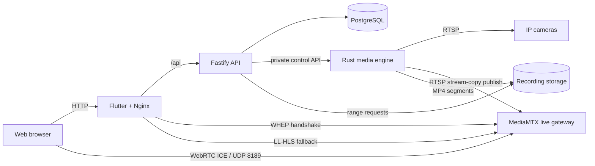

<div align="center">


# Vigilo

**A self-hosted foundation for reliable RTSP recording and playback.**

[](https://github.com/prinako/vigilo/actions/workflows/ci.yml)
[](https://github.com/prinako/vigilo/actions/workflows/docker.yml)
[](LICENSE)

[Quick start](#quick-start) · [Architecture](#architecture) · [API](#api) · [Development](#development) · [Security](#security)

</div>

> [!IMPORTANT]
> Vigilo is in early development. It is suitable for experimentation and development, but it is not yet ready to be exposed directly to the internet.

Vigilo is an open-source network video recorder built around isolated camera workers, stream-copy recording, and a small web control plane. It stores camera configuration and recording metadata in PostgreSQL while keeping video on local or mounted storage.

## Features

- RTSP recording through FFmpeg without transcoding
- Independently supervised camera workers—one failing stream does not stop the others
- Automatic recovery of enabled cameras after a service restart
- MP4 segment recording with atomic finalization and metadata indexing
- Low-latency WebRTC live previews with Low-Latency HLS fallback
- Independently supervised recording and preview processes with bounded recovery backoff
- Automatic substream selection for lower-bandwidth live previews
- Paginated recording history and byte-range media streaming
- Camera lifecycle controls and status reporting through a validated REST API
- Flutter web dashboard for camera and recording management
- OpenAPI documentation and health/readiness endpoints
- Container-first deployment with prebuilt service images

H.264 and H.265 RTSP streams that can be remuxed into MP4 are the current recording target. Browser live preview is optimized for H.264; browser codec support can vary by platform.

## Quick start

### Requirements

- Docker Engine
- Docker Compose v2
- An RTSP camera reachable from the Docker host

Clone the repository and configure the deployment:

```sh
git clone https://github.com/prinako/vigilo.git
cd vigilo
cp .env.example .env
```

Replace `VIGILO_POSTGRES_PASSWORD` in `.env` with a long, random password. When accessing Vigilo from another device, also set `VIGILO_WEBRTC_HOST` to a LAN IP or DNS name that resolves to the Docker host. WebRTC media uses UDP port `8189`, which must be reachable from the browser.

Then start the stack:

```sh
docker compose up -d
docker compose ps
curl http://127.0.0.1:3000/api/v1/health
```

Once the services are healthy, open:

| Service | URL |
| --- | --- |
| Web dashboard | <http://127.0.0.1:8080> |
| API documentation | <http://127.0.0.1:3000/docs> |
| API health check | <http://127.0.0.1:3000/api/v1/health> |

Add a camera through the dashboard or the API:

```sh
curl -X POST http://127.0.0.1:3000/api/v1/cameras \
  -H 'content-type: application/json' \
  -d '{
    "id": "front-door",
    "name": "Front Door",
    "connection": {
      "protocol": "rtsp",
      "host": "192.168.1.10",
      "port": 554,
      "username": "camera-user",
      "password": "replace-me",
      "mainStream": "/Streaming/Channels/101",
      "subStream": "/Streaming/Channels/102"
    }
  }'
```

Camera URL formats vary by manufacturer. See [Adding an RTSP camera](docs/cameras/rtsp.md) for the supported configuration shape.

Stop Vigilo without deleting its database or recordings:

```sh
docker compose down
```

## Architecture



| Component | Responsibility |
| --- | --- |
| [`apps/api`](apps/api) | TypeScript/Fastify control plane for configuration, camera lifecycle, and recording metadata |
| [`crates/media-engine`](crates/media-engine) | Rust/Tokio media plane with isolated workers and FFmpeg orchestration |
| `vigilo-webrtc` | MediaMTX gateway that converts the internal RTSP publisher into browser WebRTC and LL-HLS fallback |
| [`apps/web`](apps/web) | Flutter dashboard served by Nginx with same-origin API, WHEP, and HLS proxying |
| [`crates/vigilo-common`](crates/vigilo-common) | Shared, versionable media contracts |
| [`database/migrations`](database/migrations) | PostgreSQL schema and migrations; video blobs never enter the database |

PostgreSQL's `cameras.enabled` value is the durable desired state. The media engine reconciles that state at startup and every 15 seconds without creating duplicate workers.

FFmpeg writes an active segment as `HH-MM-SS.mp4.partial` under `<storage>/<camera>/YYYY/MM/DD/HH`. Completed, non-empty segments are atomically renamed to `.mp4` and indexed in PostgreSQL. Segment duration defaults to 60 seconds and can be configured from 5 to 3,600 seconds with `VIGILO_RECORDING_SEGMENT_SECONDS`.

### Live preview

The media engine owns all camera RTSP access. Recording always reads the configured main stream, while live preview prefers a non-empty substream and falls back to the main stream when no substream is configured.

For live preview, FFmpeg keeps H.264 as stream-copy and publishes video-only (`-c:v copy -an`) over the private `vigilo-stream` network to the `vigilo-webrtc` MediaMTX service. The browser performs a same-origin WHEP handshake through Nginx, then receives encrypted WebRTC media directly over UDP `8189`.

If WebRTC negotiation or ICE connectivity fails, the dashboard automatically falls back to MediaMTX Low-Latency HLS at `/live/<camera-id>/index.m3u8`. HLS.js is vendored under [`apps/web/web/vendor/hls.js`](apps/web/web/vendor/hls.js), so runtime playback does not depend on an external CDN.

Recording and live preview have independent FFmpeg lifecycles. If the preview publisher exits, it is restarted with capped backoff while recording continues uninterrupted. Shutdown terminates both processes. Bounded FFmpeg diagnostics are logged for troubleshooting, with RTSP URLs and credential-like values sanitized.

For WebRTC to work through Docker/NAT, set `VIGILO_WEBRTC_HOST` to an address the browser can use to reach the Docker host and allow UDP `8189` to that host. The WHEP HTTP handshake stays behind the normal Vigilo HTTPS endpoint; only the ICE media port is separately exposed.

For more context on the service split, read [ADR 0001: Service boundaries](docs/architecture/0001-service-boundaries.md).

## API

The public API is rooted at `/api/v1`. Interactive OpenAPI documentation is available at `/docs` while the API is running.

| Method | Endpoint | Purpose |
| --- | --- | --- |
| `GET` | `/health` | Report API and database health |
| `GET` / `POST` | `/cameras` | List or create cameras |
| `GET` / `PATCH` / `DELETE` | `/cameras/:id` | Read, update, or remove a camera |
| `POST` | `/cameras/:id/start` | Enable and start a camera worker |
| `POST` | `/cameras/:id/stop` | Disable and stop a camera worker |
| `GET` | `/cameras/:id/status` | Read the current worker state |
| `GET` | `/recordings?page=1&pageSize=25` | List recordings; page size is capped at 100 |
| `GET` | `/recordings/:id` | Read recording metadata |
| `GET` | `/recordings/:id/media` | Stream recording media with HTTP byte-range support |

Storage paths and camera passwords are never returned by the API.

## Configuration

The checked-in [`.env.example`](.env.example) documents all supported deployment variables. The most commonly changed options are:

| Variable | Default | Description |
| --- | --- | --- |
| `VIGILO_POSTGRES_PASSWORD` | required | PostgreSQL password used by the stack |
| `VIGILO_API_BIND` | `127.0.0.1` | Host address on which port `3000` is published |
| `VIGILO_WEB_BIND` | `127.0.0.1` | Host address on which port `8080` is published |
| `VIGILO_WEBRTC_HOST` | `127.0.0.1` | Host/IP advertised as the WebRTC ICE candidate; set to the Docker host LAN IP or DNS name for remote browsers |
| `VIGILO_WEBRTC_ICE_BIND` | `0.0.0.0` | Host address on which UDP `8189` is published |
| `VIGILO_RECORDING_SEGMENT_SECONDS` | `60` | Segment length, from 5 to 3,600 seconds |
| `VIGILO_LOG_LEVEL` | `info` | Application log verbosity |
| `VIGILO_IMAGE_TAG` | `latest` | Container image tag to deploy |
| `PUID` / `PGID` | `1000` | Runtime user and group IDs |

Database data and recordings live in the `vigilo-postgres-data` and `vigilo-recordings` Docker volumes. Back up both volumes before upgrades or host maintenance.

## Development

Use the development override to build services from the local source tree:

```sh
cp .env.example .env
# Set VIGILO_POSTGRES_PASSWORD in .env first.
docker compose -f docker-compose.yml -f docker-compose.dev.yml up --build
```

Run the repository checks locally with Node.js 22+, a stable Rust toolchain, and Flutter 3.38.7:

```sh
npm ci --prefix apps/api
npm --prefix apps/api run typecheck
npm --prefix apps/api test
npm --prefix apps/api run build

cargo fmt --check
cargo clippy --all-targets --all-features -- -D warnings
cargo test

cd apps/web
fvm flutter pub get
fvm flutter analyze
fvm flutter test
fvm flutter build web
```

For a camera-free end-to-end check, the integration stack publishes FFmpeg's `testsrc` through MediaMTX and verifies camera state, segment metadata, and an HTTP range response:

```sh
docker compose -f docker-compose.yml -f docker-compose.dev.yml \
  -f docker-compose.integration.yml up --build -d
sh scripts/integration-rtsp.sh
```

The HLS fallback can be tested for an online camera through the web service:

```sh
curl --fail http://127.0.0.1:8080/live/front-door/index.m3u8
```

See the full [development setup](docs/development/getting-started.md) for the concise contributor checklist.

## Security

Vigilo currently has no built-in authentication. Its HTTP ports bind to `127.0.0.1` by default; keep them private or place the application behind an authenticated reverse proxy. WebRTC additionally exposes UDP `8189` for encrypted ICE/DTLS media transport.

Camera passwords are omitted from responses, and FFmpeg diagnostics sanitize RTSP URLs and credential-like values before logging. The current schema still stores passwords in a restricted plaintext column, and FFmpeg receives credential-bearing URLs through process arguments. Encryption, external key-provider integration, and removal of command-line credential exposure are outstanding security work.

Please avoid disclosing security vulnerabilities in public issues. A dedicated security policy and reporting channel are still to be published.

## Roadmap

The current milestone covers recording, recovery, metadata, playback delivery, live preview, and the initial dashboard. Planned work includes:

- Authentication and encrypted secret storage
- Retention policies and storage management
- ONVIF discovery and configuration
- Motion detection, alerts, and optional AI integrations
- Broader real-camera and codec validation

## Contributing

Issues and pull requests are welcome. Before opening a pull request, run the API, Rust, and Flutter checks listed in [Development](#development), and keep changes scoped to a single concern where practical.

## License

Vigilo is available under the [MIT License](LICENSE).
