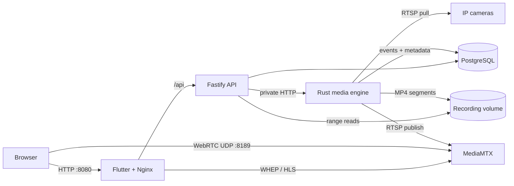

# System architecture

Aegivue separates its control plane, media plane, delivery gateway, and durable
storage. This keeps unreliable camera streams and long-running FFmpeg processes
away from user-facing API requests.

## At a glance

## Component responsibilities

| Component | Owns | Does not own |
| --- | --- | --- |
| Flutter/Nginx web | User experience and same-origin proxying | Camera credentials, recording orchestration |
| Fastify API | Validation, camera CRUD, event/recording queries, control requests | FFmpeg lifecycle, RTSP access |
| Rust media engine | Camera reconciliation, FFmpeg, recording, motion analysis, retention | Public API and browser UI |
| MediaMTX | WebRTC and LL-HLS delivery | Durable recordings and camera configuration |
| PostgreSQL | Desired camera state and searchable metadata | Video bytes |
| Recording volume | Finalized MP4 segments | Queryable metadata |

The detailed rationale is recorded in [ADR 0001](0001-service-boundaries.md).

## Core data flows

### Camera reconciliation

1. The API writes validated camera configuration to PostgreSQL.
2. The API asks the media engine to reconcile that camera.
3. The media engine starts or replaces an isolated camera worker.
4. Periodic reconciliation restores enabled workers after process restarts.

PostgreSQL is the durable desired state. In-memory worker state is disposable.

### Recording

1. A camera worker pulls the configured RTSP main stream.
2. FFmpeg writes an active `.mp4.partial` segment.
3. A completed, non-empty segment is atomically renamed to `.mp4`.
4. The media engine probes and indexes the finalized segment in PostgreSQL.
5. The API serves media with HTTP range support for seeking and playback.

Back up both PostgreSQL and the recording volume. Either one alone is an
incomplete backup.

### Live viewing

The media engine prefers the configured substream for live video and falls back to
the main stream. It publishes to MediaMTX on a private network. The browser tries
WebRTC first and falls back to LL-HLS. WebRTC signaling is proxied through Nginx,
but media normally travels directly over UDP port `8189`.

### Motion events

When enabled, a supervised detector downsamples the selected stream, compares
grayscale frames, and persists motion-event timing and scores to PostgreSQL. Its
failure and restart lifecycle is independent from recording and live publishing.
See [Motion detection and events](../motion/events.md).

## Network and trust boundaries

The stock Compose topology keeps PostgreSQL, internal media control, and RTSP
publishing off host-facing ports. Only these endpoints are intentionally exposed:

| Endpoint | Default bind | Purpose |
| --- | --- | --- |
| API | `127.0.0.1:3000` | REST API and OpenAPI UI |
| Web | `127.0.0.1:8080` | Dashboard and same-origin proxies |
| WebRTC media | `0.0.0.0:8189/udp` | Direct browser media path |

Binding the API or web service to `0.0.0.0` expands the trust boundary. Aegivue
currently expects network-level access control or an authenticated reverse proxy.

## Failure isolation

- Each camera has a supervised worker; one bad stream should not stop others.
- Motion analysis can restart without taking down recording or live viewing.
- The API remains available when a camera or FFmpeg child is unhealthy.
- Health checks and reconciliation favor recovery over persistent in-memory state.
- Finalization avoids exposing actively written files as completed recordings.

## Design constraints

- Browser codec support makes H.264 the safest live-view choice.
- Stream-copy recording depends on camera streams being suitable for MP4 remuxing.
- Database and filesystem consistency is managed explicitly rather than through a
  single transaction.
- Camera secrets are omitted from read models and structured logs, but encrypted
  secret storage is not yet implemented.
